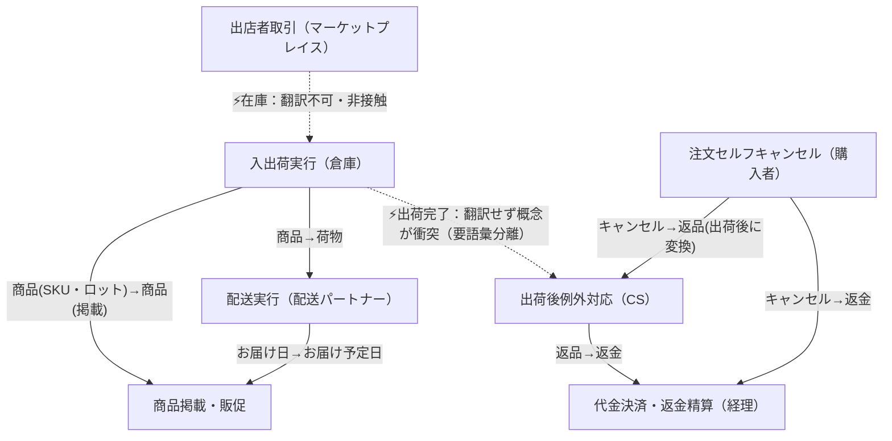

> mino-context-discovery の実行例（EC「よろず屋オンライン」題材、2026-07-12検証済み）。出力契約5点の書式のお手本として参照する。
> ⚠️ これは素材が十分な場合の**分量の上限例**。薄い素材でこの分量を出したら捏造を疑うこと。真似るべきは分量ではなく、すべての結論が素材に遡れる根拠の付け方である。

# mino-context-discovery パイロット実行ログ — 「よろず屋オンライン」ヒアリングメモ

実行環境: 非対話（バッチ）。SKILL.mdの非対話ルールに従い、承認ゲート（G1/G2）は「確認事項の列挙」として出力し、未確認の仮定は保留事項に明記して続行した。

以下、出力契約（5点）に準拠。

---

## 1. コンテキスト一覧表

| コンテキスト | アクター | 目的 | 文脈 | 主要ルール |
|---|---|---|---|---|
| 入出荷実行（倉庫） | 在庫スタッフ（倉庫） | 自社倉庫内の実在庫を正確に把握し、出荷作業を実行する | 入荷〜棚卸し〜出荷作業の実行中 | 「商品」はSKU・ロット単位で数える／出店者在庫には接触しない／梱包しトラックに積載した時点で「出荷完了」を確定する |
| 出店者取引（マーケットプレイス） | 出店者 | 自身の商品在庫を自己管理し、プラットフォーム上で販売機会を得る | 出店者の商品をプラットフォームに掲載・販売する取引関係の中 | 在庫の保有・管理責任は出店者側にあり、自社倉庫スタッフの権限が及ばない（触れてはいけない） |
| 商品掲載・販促 | 販促企画担当 | 商品を魅力的に見せ、販売施策により売上機会を最大化する | 商品ページ作成・販売施策の立案時 | 「商品」は商品ページ（掲載）単位で扱う／「お届け予定日」を販売訴求のために確定的に見せたい |
| 注文セルフキャンセル（購入者） | 購入者 | 出荷前の注文について自分の意思で確定・取消ができる | 注文確定後、出荷が行われるまでの間 | 出荷前ならマイページから購入者自身が「キャンセル」を実行できる（セルフサービス） |
| 出荷後例外対応（CS） | CSオペレーター | 出荷後に発生する購入者からの例外的申し出やトラブルを受け止め、社内処理へ変換し、正確な状況を伝える | 出荷後に購入者から問い合わせ・申し出があったとき | 出荷後の「キャンセルしたい」という申し出は「返品」として受け付ける／購入者が受け取るまでは「完了」と案内しない |
| 配送実行（配送パートナー） | 配送業者（外部2社） | 荷物を届け先まで物理的に運搬する | 出荷された荷物を配送網に乗せて届け先まで運ぶ間 | 中身が何であれ一律「荷物」と呼ぶ／「お届け日」は経路都合で変動しうる |
| 代金決済・返金精算 | 経理担当 | 金銭の授受を正しく記帳・処理する | 注文・キャンセル・返品に伴う金銭の授受が発生する時点 | キャンセル・返品を区別せず、最終的にすべて「返金」処理として扱う |

※コンテキスト数（7）とアクター数（7）が一致している点は反証チェック#6（アクター1人=1コンテキストの疑い）に該当しうるため、STEP6で個別に再検証した（4-5参照）。

---

## 2. 用語×コンテキスト意味マトリクス（断層マーク付き）

### 2-1. 横断マトリクス

| 用語 | 入出荷実行 | 出店者取引 | 商品掲載・販促 | 注文セルフキャンセル | 出荷後例外対応 | 配送実行 | 代金決済・返金精算 | 断層 |
|---|---|---|---|---|---|---|---|---|
| 商品 | SKU・ロット単位の物理個体を数える対象 | — | 商品ページ（掲載）単位。1掲載＝1「商品」 | — | — | 中身種別を問わず「荷物」に包含される | — | ⚡ 倉庫は物理粒度、企画は掲載粒度。棚卸しで揉める直接原因 |
| 在庫 | 自社倉庫内の自社在庫。倉庫スタッフが計数・接触してよい | 出店者が自己保有・自己管理。倉庫スタッフは接触してはいけない | — | — | — | — | — | ⚡ 同じ語が指す実体の所在・接触可否が真逆 |
| キャンセル | — | — | — | 出荷前、購入者自身がマイページから実行（セルフサービス） | 出荷後の同じ申し出は「返品」に読み替えて受付 | — | 「返金」に統合され区別されない | ⚡ 出荷前後で処理主体・呼称そのものが変わる（時間・状態依存） |
| 返品 | — | — | — | — | 出荷後キャンセル申し出への社内処理の呼称 | — | 返金のトリガーとして「返金」に統合 | 上記キャンセルの断層と対をなす |
| 返金 | — | — | — | — | — | — | キャンセル・返品を区別しない会計処理 | ⚡ 現場では別概念の2語が、経理では1語に縮退する |
| 出荷完了 | 梱包してトラックに積載した時点で確定してよい | — | — | — | 購入者が実際に受け取るまでは「完了」と呼ばない | — | — | ⚡ 工程完了 ≠ 顧客受領完了。過去に案内ミス事件が実証済み |
| 荷物 | 「商品」が内容物として包含される | — | — | — | — | 中身の属性（自社/出店者、商品種別）を問わない一律呼称 | — | ⚡ 属性を持つ「商品」が、配送コンテキストでは属性なしの「荷物」に匿名化される |
| お届け日 | — | — | — | — | — | 配送業者が経路上の実行可能性に基づき約束。変動しうる | — | 配送実行における実務上の見込み値 |
| お届け予定日 | — | — | 販売施策として購入者向けサイトに表示したい、確定的に見せたい日付 | — | — | （お届け日から翻訳される） | — | ⚡ 「変動しうる見込み」と「確定的訴求」の間で毎回調整コストが発生 |

（中核用語は9個。素材が断片的なため、SKILL.mdの目安「10〜20個」に届かない。無理に水増しせず、根拠のある語のみ採用した＝4-4参照）

### 2-2. コンテキスト別ユビキタス言語表

**入出荷実行（倉庫）**

| 用語 | このコンテキストでの意味 | 付随ルール | 他コンテキストでの対応語（翻訳） |
|---|---|---|---|
| 商品 | SKU・ロット単位の物理個体 | 数える対象は現物。ロット単位で数量照合 | 商品掲載・販促の「商品（掲載単位）」、配送実行の「荷物」 |
| 在庫 | 自社倉庫内にある自社所有商品の数量 | 倉庫スタッフのみ計数・入出庫操作可 | 出店者取引の「在庫」（別実体・非対応＝翻訳不可） |
| 出荷完了 | 梱包してトラックに積載した時点 | この時点でシステム上「出荷完了」を確定してよい | 出荷後例外対応の「完了（お届け）」（別時点。要語彙分離） |

**出店者取引（マーケットプレイス）**

| 用語 | このコンテキストでの意味 | 付随ルール | 他コンテキストでの対応語 |
|---|---|---|---|
| 在庫 | 出店者が自己保有・自己管理する商品の数量 | 倉庫スタッフは接触・計数してはならない | 入出荷実行の「在庫」（別実体・非対応） |

（出店者自身の目的・プロセスに関する用語は素材に乏しく、これ以上の定義は保留＝4-4）

**商品掲載・販促**

| 用語 | このコンテキストでの意味 | 付随ルール | 他コンテキストでの対応語 |
|---|---|---|---|
| 商品 | 商品ページ（掲載）単位の1エントリ | 販促・売上集計・訴求はこの単位で行う | 入出荷実行の「商品（SKU・ロット単位）」 |
| お届け予定日 | 購入者向けサイトに表示する、販売施策として提示したい日付 | 訴求のため確定的にしたいが、配送側の制約と毎回調整が必要 | 配送実行の「お届け日」 |

**注文セルフキャンセル（購入者）**

| 用語 | このコンテキストでの意味 | 付随ルール | 他コンテキストでの対応語 |
|---|---|---|---|
| キャンセル | 出荷前に購入者自身がマイページから注文を取り消す行為 | 出荷前のみ有効。購入者本人がセルフサービスで実行 | 出荷後は同じ「キャンセル」という言葉のまま出荷後例外対応コンテキストに引き継がれ、そこで「返品」に変換される |

**出荷後例外対応（CS）**

| 用語 | このコンテキストでの意味 | 付随ルール | 他コンテキストでの対応語 |
|---|---|---|---|
| 返品 | 出荷後に購入者が「キャンセルしたい」と申し出た内容をCSが受け付けて処理する呼称 | 購入者はキャンセルと呼ぶが、社内的には返品として処理 | 注文セルフキャンセルの「キャンセル」、代金決済・返金精算の「返金」 |
| 完了（お届け） | 購入者が実際に荷物を受け取った時点 | 受取確認前に「完了しました」と案内してはならない | 入出荷実行の「出荷完了」（別時点。混同注意＝過去の事件） |

**配送実行（配送パートナー）**

| 用語 | このコンテキストでの意味 | 付随ルール | 他コンテキストでの対応語 |
|---|---|---|---|
| 荷物 | 中身の属性を問わない運搬対象の一律呼称 | 報告書上、中身の種別を区別しない | 入出荷実行／商品掲載・販促の「商品」 |
| お届け日 | 配送業者が経路上の実行可能性に基づき約束する日 | 経路都合により変動しうる（配送業者の裁量） | 商品掲載・販促の「お届け予定日」 |

**代金決済・返金精算（経理）**

| 用語 | このコンテキストでの意味 | 付随ルール | 他コンテキストでの対応語 |
|---|---|---|---|
| 返金 | キャンセル・返品を問わず購入者へ金銭を戻す会計処理 | キャンセルと返品を区別せず同一の会計処理として扱う | 注文セルフキャンセルの「キャンセル」、出荷後例外対応の「返品」 |

---

## 3. コンテキストマップ

矢印の向きは依存の向き（事実・制約の発生源→それを受け取る側）。破線（-.->）は通常の翻訳ではなく「意味の衝突」または「意図的な非接触境界」を示す。

---

## 4. 判断根拠と保留事項

### 4-1. 根拠（アクター×目的の棚卸し／STEP1）

| アクター | 目的（「なぜ」で遡った上位目的） |
|---|---|
| 購入者 | 欲しい商品を確実に受け取り、必要なら自分の意思決定（購入）を撤回できる |
| 出店者 | 自分の商品在庫を自己管理し、プラットフォーム上で販売機会を得る |
| 在庫スタッフ（倉庫） | 自社倉庫内の実在庫を正確に把握し、出荷作業を実行する |
| 配送業者（2社） | 荷物を届け先まで物理的に運搬する |
| CSオペレーター | 購入者からの問い合わせ・トラブルを受け止め、社内処理につなぐ |
| 販促企画担当 | 商品を魅力的に見せ、販売施策により売上機会を最大化する |
| 経理担当 | 金銭のやり取りを正しく記帳・処理する |

### 4-2. 各境界の根拠（素材への遡行）

- **入出荷実行 vs 商品掲載・販促の断層**：「倉庫の在庫スタッフはSKU・ロット単位で数えているが、販促企画の言う『商品』は商品ページ（掲載）単位だった」という記述に直接根拠を持つ。棚卸しトラブルの実例が断層の実証。
- **入出荷実行 vs 出店者取引の断層**：「出店者の在庫は出店者側にあり、うちの倉庫スタッフは触れない」という記述が根拠。在庫の所在・接触可否という「ルール」が真逆であることを直接示す一文。
- **注文セルフキャンセル vs 出荷後例外対応の断層**：「キャンセルは出荷前なら購入者がマイページから自分でできる。出荷後にキャンセルしたいという問い合わせはCSが受けて『返品』として処理する」に根拠を持つ。出荷という状態変化点でルール・処理主体が変わる典型例。
- **入出荷実行 vs 出荷後例外対応（出荷完了の断層）**：「倉庫では梱包してトラックに載せたら『出荷完了』。CSは購入者が受け取るまで『完了』とは言わない」＋「この食い違いで購入者への案内ミスが起きた」という実際の事故記述に根拠を持つ。数ある断層の中で唯一「実害（案内ミス）」が明記されている、優先度の高い断層。
- **配送実行 vs 商品掲載・販促の断層**：「配送業者からの報告書では中身が何であれ『荷物』と呼ばれる」「『お届け予定日』は販促企画が販売施策として決めたがっている。ここで毎回調整が発生する」に根拠を持つ。「毎回調整が発生する」という一文が、これが単発ではなく構造的な断層であることを示す。
- **注文セルフキャンセル／出荷後例外対応 vs 代金決済・返金精算の断層**：「経理はどちらも最終的に『返金』の処理として扱っている」に根拠を持つ。現場の2語（キャンセル・返品）が会計コンテキストでは1語に縮退する。

### 4-3. 確認事項（承認ゲート相当。非対話環境のため列挙形式で出力）

**G1相当（アクター×目的の抜け漏れ確認）**
1. 出店者の商品は誰が出荷するか（自社倉庫が代行するのか、出店者が直送するのか）。素材に記載がなく、入出荷実行と出店者取引の間の実際の連携有無が不明。
2. 配送業者2社は役割分担があるか（地域別・サイズ別など）、それとも同一機能の並列委託か。今回は1つの「配送実行」コンテキストに統合したが、ルールが業者間で異なるなら再分割が必要。
3. 「返金」の実行主体（決済代行・カード会社など）は経理担当の外に別アクターとして存在するか。
4. 監査担当・出店者への支払精算担当など、時間差で現れるアクターは他にいないか。

**G2相当（境界仮説への合意確認）**
5. 7つの境界仮説（一覧表）に抜け・異論はないか。特に「出店者取引」は素材が薄く、暫定境界であることに合意できるか。
6. 「入出荷実行」と「出荷後例外対応」の間の「出荷完了」という同一語の衝突について、実務上は用語自体を分離する（例：倉庫工程は「出荷完了」、顧客向けは「お届け完了」）方向で対応してよいか。

### 4-4. 保留事項（未確認の仮定）

- 出店者取引コンテキストは「在庫は出店者側にあり倉庫スタッフは触れない」の一文のみを根拠とした暫定境界。出店者自身の目的・プロセス（出荷主体、在庫連携方法）は素材になく、ユビキタス言語表も最小限にとどめた。
- 「商品掲載・販促」コンテキストの「商品（掲載単位）」が、自社商品と出店者商品を区別せず同じ粒度で扱っているのかは素材からは不明。
- 配送業者2社間でルール差があるかは不明のため、差がない前提で1コンテキストに統合した。
- 経理が扱う概念のうち、返金以外（与信・請求・出店者への支払精算など）は素材になく対象外とした。
- 中核用語は9個で、SKILL.mdの目安（10〜20個）を下回る。素材が断片的なため無理に水増しせず、根拠のある語のみを採用した。

### 4-5. 反証ラウンドでの修正記録（STEP6・必須）

反証チェック1〜8を実施。該当した項目と対応は以下の通り。

- **#6（アクター1人＝1コンテキントの疑い）に該当**：コンテキスト数（7）とアクター数（7）が一致し、一見「発言者ごとに切っただけ」に見える。個別に検証した結果、各境界は目的の違い（自社実在庫把握／委託在庫の非接触／販促訴求／購入者の自己決定／出荷後の人的例外対応／物理輸送／金銭記帳）に基づいており、単なる部署・発言者分割ではないと判断し維持した。ただし「出店者取引」は根拠が薄いため要再確認（4-3のG2参照）。
- **#7（時間・状態変化による意味変化）に該当・むしろ積極的に採用**：「注文セルフキャンセル」と「出荷後例外対応」を最初は1つの「注文キャンセル・返品」コンテキストに統合する案も検討したが、SKILL.md自身が反証チェック#7の例として「注文は出荷前後でルールが別物」を挙げていることと整合させ、出荷前後で処理主体（購入者本人 vs CS）・処理内容（セルフキャンセル vs 返品業務）が構造的に異なることを確認したため、2つの独立コンテキストとして維持した。
- **#8（「共通」「管理」「マスタ」という名前）に該当・修正した**：初期案の仮称「マーケットプレイス出店管理」「入出金・会計処理」は目的の言語化から逃げた名前と判断し、それぞれ「出店者取引」「代金決済・返金精算」に改称した。
- **#1〜#3（組織図／DBテーブル／画面単位のなぞり）**：該当なし。素材からは組織構造やシステム構成の情報が得られないため判定材料もない。
- **#4（同一コンテキスト内での二重の意味）**：該当なし。各コンテキスト内で用語の意味は単一に定まっている。
- **#5（異音同義の統合漏れ）**：「荷物」と「商品」、「キャンセル」と「返品」は同一の実体・意図を指しうるが、これは統合漏れではなく目的の異なるコンテキスト間の意図的な翻訳関係として3章のコンテキストマップに記録した。

---

## 5. ネクストアクション

- **mino-model-deepening へ**：「入出荷実行」コンテキストの商品／在庫モデル（SKU・ロット・掲載の関係をどう集約設計に落とすか）。「代金決済・返金精算」コンテキストの返金モデル（キャンセル起因／返品起因の違いを内部でどう表現するか、あるいは本当に区別不要か）。
- **mino-event-storming へ**：「注文セルフキャンセル→出荷後例外対応」の状態遷移（出荷というイベントを境に発生するイベント群の整理）。「出荷完了」認識ズレ事件の業務フロー（倉庫の出荷完了イベント〜配送〜CSの受領確認イベントまでの時系列）。
- **追加ヒアリング推奨**：出店者取引コンテキストの実態（出荷主体、在庫連携の有無、出店者向け決済精算の有無）。配送業者2社の役割分担有無。

---

